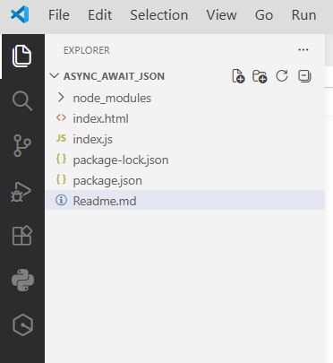
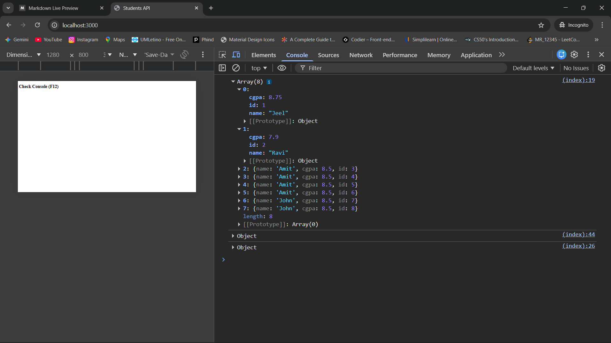
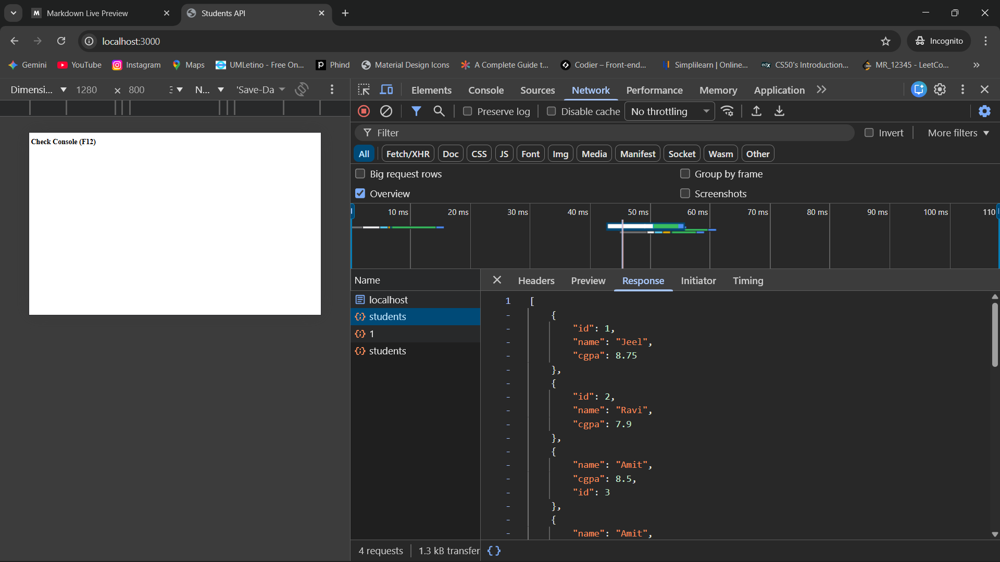

# Async / Await and JSON API using Node.js

This project demonstrates how to use **Async/Await**, **Fetch API**, and
**JSON APIs** using Node.js and Express.js.

The server provides simple APIs to:

-   Get all students
-   Get a student by ID
-   Add a new student

The browser calls these APIs using async/await and displays the result
in the console.

------------------------------------------------------------------------

# Steps for the Practical

## 1) Create a Project Folder

Create a folder named:

    async_await_json

------------------------------------------------------------------------

## 2) Open the Folder in VS Code

Open the folder in VS Code and start the terminal.

Run the following command to initialize the project:

``` bash
npm init -y
```

Example:

    C:\Desktop\async_await_json> npm init -y

This command creates a **package.json** file.

------------------------------------------------------------------------

## 3) Install Express

Install Express using the following command:

``` bash
npm install express
```

Example:

    C:\Desktop\async_await_json> npm install express

Express is used to create the **server and APIs**.

------------------------------------------------------------------------

## 4) Create Project Files

Inside the project folder, create the following files:

    index.js
    index.html

------------------------------------------------------------------------

## 5) Setup Express Server (index.js)

In `index.js`:

1.  Import Express
2.  Create an Express application
3.  Enable JSON middleware
4.  Serve static files
5.  Create a students array

Example for JSON middleware:

``` javascript
app.use(express.json());
```

This middleware parses JSON data sent from the client.

Example for serving HTML files:

``` javascript
app.use(express.static(__dirname));
```

This allows the browser to access the `index.html` file.

Example students array:

``` javascript
const students = [
  { id:1, name:'Tom', cgpa:8.75 }
];
```

------------------------------------------------------------------------

## 6) Create API Routes

Create API routes in `index.js`.

Example: **Get all students**

``` javascript
app.get('/api/students', (req,res) => {
  res.json(students);
});
```

Start the server using:

``` javascript
app.listen(3000, () => {
  console.log('localhost:3000 is running');
});
```

Now the server will run on:

    http://localhost:3000

------------------------------------------------------------------------

## 7) Call the API from the Browser (index.html)

Inside the `<script>` tag in `index.html`, call the API using **fetch**
and **async/await**.

Example:

``` javascript
(async () => {
  const res = await fetch('/api/students');
  const data = await res.json();
  console.log(data);
})();
```

Explanation:

-   `fetch()` sends an HTTP request to the server
-   `await` waits for the response
-   `res.json()` converts the JSON response into a JavaScript object
-   `console.log()` prints the result in the browser console

------------------------------------------------------------------------

## 8) Add More APIs (GET by ID and POST)

Next, create APIs for **getting a single student** and **adding a new
student**.

### Get a Single Student by ID

Example API in `index.js`:

``` javascript
app.get('/api/students/:id', (req,res) => {
  const s = students.find(
    s => s.id === +req.params.id
  );
  res.json(s);
});
```

Call this API in `index.html`:

``` javascript
(async () => {
  const res = await fetch('/api/students/1');
  const data = await res.json();
  console.log(data);
})();
```

------------------------------------------------------------------------

### Add a New Student (POST)

Example API in `index.js`:

``` javascript
app.post('/api/students',(req,res)=>{
  const s = req.body;
  s.id = students.length + 1;
  students.push(s);
  res.status(201).json(s);
});
```

Call this API in `index.html`:

``` javascript
(async () => {
  const res = await fetch('/api/students', {
    method: 'POST',
    headers: {
      'Content-Type': 'application/json'
    },
    body: JSON.stringify({
      name: 'John',
      cgpa: 8.5
    })
  });

  const data = await res.json();
  console.log(data);
})();
```

Explanation:

-   `method: 'POST'` sends data to the server
-   `headers` tell the server what type of data is being sent
-   `JSON.stringify()` converts a JavaScript object into JSON text
-   The server receives the data using `req.body`

------------------------------------------------------------------------

## Output

### Step 1: Start the Server & Open the Developer Tools

``` bash
node .\index.js
```

Example:

    C:\Desktop\async_await_json> node .\index.js

Open the browser and go to:

    http://localhost:3000

Press **F12** to open **Developer Tools** and click the **Console** tab
to see the API responses printed using `console.log()`.

You can also open **Developer Tools**  by:

1. Right-click anywhere on the webpage
2. Click **Inspect**

---

### Step 2: Open the Console Tab

After the Developer Tools open, you will see several tabs such as:

- Elements
- Console
- Sources
- Network

Click on the **Console** tab.

The Console is used to display messages printed using `console.log()`.

---

### Step 3: View the API Response

In this project, we used:

``` javascript
console.log(data);
```

------------------------------------------------------------------------

# Working Flow

## Browser: fetch the API

This code creates an async function that runs immediately. It calls the
API using `fetch()`, waits for the response using `await`, converts the
JSON response into a JavaScript object using `res.json()`, and finally
prints the data in the browser console.

    Browser runs JavaScript
            │
            ▼
    fetch() sends request to API
            │
            ▼
    Node.js server processes request
            │
            ▼
    Server returns JSON data
            │
            ▼
    res.json() converts JSON → JS object
            │
            ▼
    console.log() prints result

## GET one student by ID

This code sends a request to the server asking for the student with ID
1, waits for the response, converts the JSON data into a JavaScript
object, and prints it in the browser console.

    Browser runs JavaScript
            │
            ▼
    fetch('/api/students/1')
            │
            ▼
    Server receives request
            │
            ▼
    Server finds student with ID = 1
            │
            ▼
    Server returns JSON data
            │
            ▼
    res.json() converts JSON → JS object
            │
            ▼
    console.log() prints student

## POST --- add a new student

This code sends a POST request to the server to create a new student.
The student data is sent in JSON format, the server processes it and
creates a new student, then the browser receives the response and prints
the created student in the console.

    Browser runs JavaScript
            │
            ▼
    fetch() sends POST request
            │
            ▼
    Student data sent in JSON format
            │
            ▼
    Node.js server receives data
            │
            ▼
    Server adds student to array
            │
            ▼
    Server returns new student with ID
            │
            ▼
    res.json() converts JSON → JS object
            │
            ▼
    console.log() prints result

------------------------------------------------------------------------

# JSON.stringify()

HTTP requests require **text format**, not JavaScript objects.\
So we convert the object into JSON text using `JSON.stringify()`, send
it to the server, and the server converts it back into an object.

## JavaScript Object (inside JS code)

Keys do not require quotes:

    { name: "Amit", cgpa: 8.5 }
## JSON Format (after JSON.stringify())

- Keys must have quotes
- It is text/string format

```json
{"name":"Amit","cgpa":8.5}
```

## Output Screenshot

## Project Folder Structure



## Get Student Data (API Response)



## Network Tab – JSON API Response


